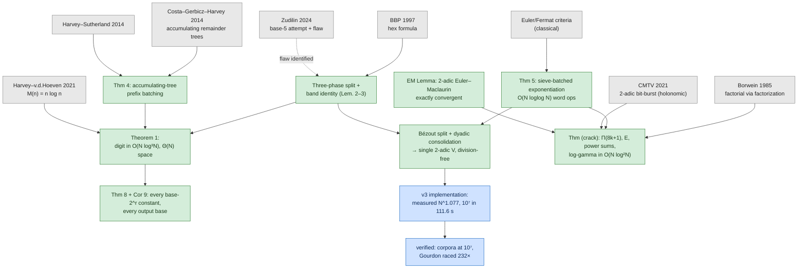
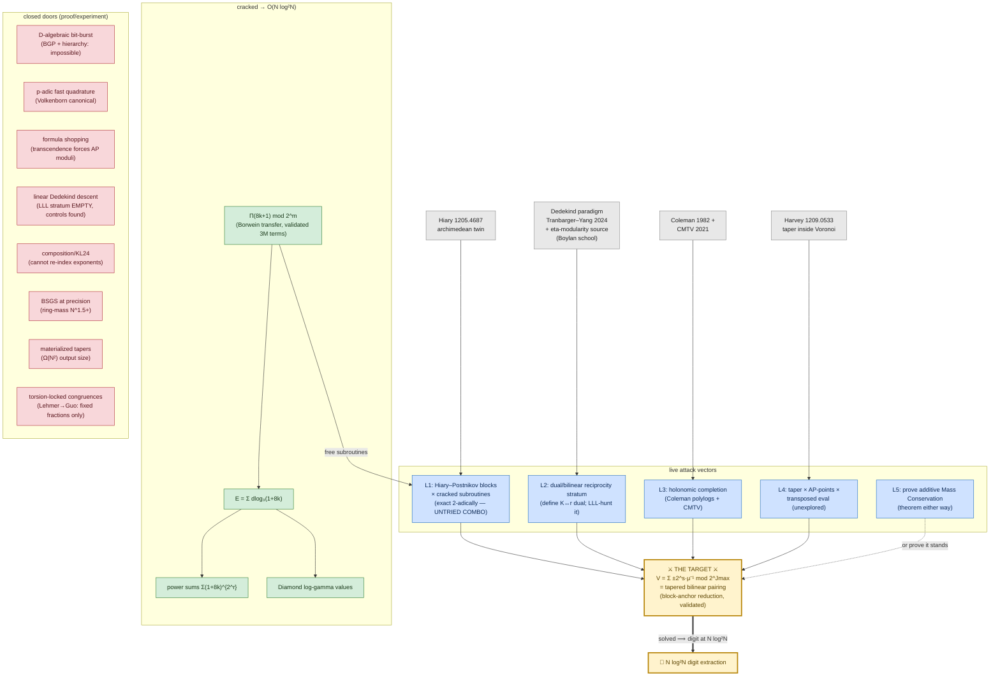

# Campaign Graph — the road to N·log²N
**Living document. Update on every crack.** Companion to `decimal_extraction_paper.tex` and `cracks_dossier.md`.

**Status line:** digit extraction **proven O(N log³N)** (measured N^1.077, verified to 10⁷) · multiplicative faces **cracked to O(N log²N)** · remaining: **V** — solve in O(M(N) log N) ⟹ digit at **N log²N** = **PARITY WITH FULL COMPUTATION** (Brent–Salamin/AGM computes *all* N digits in O(N log²N) since 1976 — the benchmark, now named; the prize is extraction that costs no more than computation while keeping extraction semantics).

**Cross-formula law (stilt audit, validated):** for every BBP family d·t+1 (d = 4…16), the tower obeys **min v₂(R_s) = s + v₂(d) − 1** — slope 1 universally, formula only shifts the constant. No formula shopping beats the ceiling; the atom is formula-independent at the tower level.

**AGM/depth-doubling route: CLOSED (three kills).** (1) Lerch duplication is exact but parameter-branching — one param → N params in log N doublings = the product tree again; log has an AGM because it has one parameter. (2) Large-parameter expansion (ninth face: V = (1/A)Σ(8/A)^j·Eulerian-rationals, convergent) = the Bernoulli-table taper, both 2-adically and in the real-analytic analog. (3) LLL hunt (`agm_law_hunt.py`, controls at height O(1), noise floors 2^17–2^38): **no algebraic cross-scale relation on the truncated log — linear, quadratic, or exp-side. No Landen ladder exists.** V's pole-adjacent form Σ_{s<T}16^s/(A−8s), truncation edge just before the pole, now on the board as the reflection-normal form.

**L2 reciprocity: CLOSED EMPTY** (swap-hunt at two parameter points, ζ₈-duals linear+quadratic, controls at height O(1); real-analytic analog requires the transcendental Fresnel remainder — 2-adically nothing algebraic replaces it). **Attack (3) delivered:** Remark (structural exclusions) now in the paper — four idea-classes excluded in print: formula shopping, AGM/depth-doubling, incomplete reciprocity, algebraic cross-scale relations. Conjecture upgraded from "no idea found" to "idea-classes excluded."

**★ THE TAME/WILD MIRROR (new, 3rd-field consistency + import program):** finite-field exponential sums split exactly as our war does — tame (Gauss/Jacobi = Γ_p products, cheap) ⟺ our cracked multiplicative cluster; wild (Kloosterman, no polylog algorithm known, decades open) ⟺ V. Salié exception tested on V (quadratic twists, two parameter points): does NOT fire — V is Kloosterman-like. Open import: reduction V ↔ single-Kloosterman-mod-p would transfer their hardness evidence wholesale.

**★ THE CARRY FACE (tenth face, from the "pieces" push):** V sliced into G-bit windows: every slice-sum is word-cheap modexp data (windows of the periodic strings 1/μ_t) — the ENTIRE hardness = the Θ(N/G) carry bits between slices. Naive algorithm blocked (terms span J_t/G slices → N²/G), but this is the thinnest known compression of the wall and the best target for (a) restricted-model lower bounds (carry/communication complexity has real techniques) and (b) Las-Vegas near-boundary refinement.

**Attack queue:** #1 → **write the Dwork-tower standalone note** (tower + collapse lemma + engine + cross-formula law). #2 → **prove Mass Conservation in a restricted model — via the CARRY FACE** (communication-complexity flavor; the exclusions remark is scaffolding). #3 → **Kloosterman↔V reduction hunt** (the tame/wild import). #4 → periodic literature sweeps (KL24-adjacent, p-adic Lerch, unit-root crystals, exponential-sum computation).

**★★ THE ATOM (8th face, validated):** V ⟺ **the truncated logarithm** — trunc_M[Log₂(1−z)], v(z) = ½, mod 2^m, M ≈ m ≈ N, target Õ(N). The COMPLETE log is quasi-linear, and the complete sum Σ16^t/(8t+1) = eight ramified logs over ℚ₂(ζ₈) (8-section identity, validated 880 bits, extension components cancel identically). The Dwork tower = the (1−φψ)-crystal of this filtered log; U_∞ = its unit root. Everything the campaign has is now one sentence: *complete logs are cheap; truncated logs are the war.*

**QUEUE #0: CLOSED BY DERIVATION (complete arc in one day: discovery → structure → engine → ceiling).** The tower exists (congruence mod 2^{s+2}, cascade with convergent U_∞ — all machine-verified), and is now PROVEN-in-sketch via the collapse lemma (convolutions of truncations → single dyadic-block harmonic sums, exact algebra) + complete-block inversion (Σv⁻¹ ≡ Σv mod 2^L — the precision source). **Ceiling established: the tower's O(s) precision IS complete-block magic; deeper block precision IS the atom. Dwork amplification ≡ the atom — the tower is V's fifth face-mechanism, not its solvent.** Banked: the collapse lemma (products of truncated series → single sums — independent machinery); the provable tower (paper-grade novelty for a 2-ramified ₂F₁).

**★★ 2026-07-21 (audit + Dwork closure + arXiv hardening) — the excellent-lift hope is DEAD at p=2, and the atom is a NAMED open problem.**
- **Dwork excellent-lift descent (the one live amplification hope): CLOSED.** Independent Frobenius-side validation (`validation/dwork_amplify.py`, `dwork_crossformula.py`): the classical Dwork residual f_{s+1}(x)·f_{s-1}(x²) − f_s(x)·f_s(x²) for f = ₂F₁(1/8,1;9/8;x) has min-coefficient valuation **exactly s + v₂(d) − 1** across d = 2,4,8,16 — reproducing the cross-formula tower law from a completely different construction (slope 1, formula-independent). So basic Frobenius descent yields only Θ(log N) 2-adic digits at the depth log N that N terms require. **The one amplifier — an excellent Frobenius lift to mod p^{2s} — requires p ODD (Beukers–Vlasenko, *Dwork Crystals III*: the refinement needs 1 ≤ k < p), hence VACUOUS at p = 2; and B–V could not prove even the p^{2s} truncated-sum congruence.** Move Dwork amplification to the graveyard beside formula-shopping. (The standalone Dwork-tower *note* — tower + collapse lemma — remains worth writing as a self-contained congruence result; only the "it solves V" hope is dead.)
- **The atom is a recognized open problem, not a gap we're missing.** Five-agent literature sweep, primary sources read: V's core = isolated harmonic number mod 2^N = 2-adic digamma ψ₂(K+1/8) = odd-Pochhammer log-derivative = single-argument factorial-mod-prime-power. Confirmed OPEN by the domain authorities: **Johansson** (FLINT/Arb — nothing beats binary splitting for an isolated H_n; the factorial's log-shave is *not known to transfer to the sum*, which is exactly our "differentiation destroys the factorization": `atom_check.py` shows Π(0)=∏(8k+1) smooth but Π′(0) generic with a 961-bit prime factor at K=200); **Harvey** (single-prime (p−1)! mod p² is Õ(√p), beating it open and tied to no-poly-time point counting; Kurepa's Σk! is the identical 2×2 accumulator). Hardness neighborhood (evidence, not proof): **#P-dichotomy** (Cai–Chen–Lipton–Lu — quadratic exp-sums = P via Gauss, degree ≥ 3 #P-hard even at fixed prime power); **Kloosterman** (Bruin — no efficient classical single-sum; Kowalski–Sawin / Milićević–Zhang — partial sums pseudorandom *even mod p^k*, so completeness not field-vs-ring is what makes complete sums tame). It is the arithmetic-mod-2^N twin of the famous "compute π/e to N bits in O(M(N)) without the binary-splitting log factor."
- **Closest existing machine (lead texture, not a crack):** Costa–Kedlaya–Roe `amortizedHGM` builds a block-triangular matrix carrying a product AND its sum-of-partial-products (a p-adic Γ and — *our* observation — its digamma), but amortized over all p ≤ X. Sharp open question: trade that amortization axis for single-argument precision at fixed p = 2. Likely a long shot (amortization IS the speedup), but the one machine of the right shape.
- **Paper hardened to arXiv-ready** (`paper_audit.md` = full ledger). 2 blockers fixed: (i) the main-theorem space/time overclaim — now honest via a **remainder-forest Proposition** (Θ(N) space at quasi-linear time, Harvey–Sutherland); (ii) the false "no p-adic Γ in libraries" claim (PARI/GP `lngamma` computes Diamond's function for |x|>1 — exactly our arguments). 5 majors + polish; §6 fortified with all the literature above; every citation verified against primary sources (BBG04 author order and ZZ15 venue corrected); AI-assistance disclosure added. 37 refs, 0 orphans; compiles clean, 17 pp.

---

## Graph 1 — The result stack (what builds on what)

## Graph 2 — The war-map of the last log

## Live attack queue (next concrete actions)

| # | Vector | Ammunition | Next concrete action | Session cost |
|---|---|---|---|---|
| 0 | **★ Dwork/Cartier descent — CLOSED 2026-07-21** | Beukers–Vlasenko I–III, CKR amortizedHGM | ~~precision amplification via excellent lifts~~ — DONE & DEAD: Dwork residual valuation measured = s+v₂(d)−1 (slope 1, `dwork_amplify.py`); excellent lift to p^{2s} needs p odd (B–V DC-III), vacuous at p=2. Amplification not available. | — |
| 1 | **L1 blocks × crack** | Hiary 1205.4687 + Thm (crack) subroutines | Superseded in priority by #0; block route dispositioned at N^{1.5} (see crawler report) | — |
| 2 | **L2 dual stratum** | Fedotov–Klopp exact identity, Dedekind descent, validated LLL harness | Define the (K,r)-dual object (what swaps under a Landsberg–Schaar analogue); extend `relation_hunt.py` to bilinear/dual components | 1 session |
| 3 | **L4 taper×multipoint** | Harvey Prop. 2, transposed evaluation | Attempt tapered multipoint with AP structure; the pairing Σf_j·p_j without materialization | deep |
| 4 | **L3 completion** | Coleman polylog identities | Hunt a truncation-for-holonomic-evaluations trade; cheap to rule out | ½ session |
| 5 | **L5 the theorem-either-way** | compactness observation, basis inventory | Formalize basis-respecting circuits; prove Ω(N²/polylog) for the pairing in-model | deep |

## Source index (campaign-critical only — full list in paper + dossier)

| Key | Source | Role |
|---|---|---|
| BBP97 | Bailey–Borwein–Plouffe, Math. Comp. 66 | the formula; the SC* open problem |
| BBG04 | Borwein–Borwein–Galway, Canad. J. Math 56 | no non-binary Machin-BBP (why the wall existed) |
| Gourdon03 | unpublished, Feb 2003 (never revised — CDX-verified) | prior N² record; Thm 2 asserted tradeoff |
| Zudilin24 | arXiv:2409.10097 (v1 "base 10") | the flaw we repaired; zero citations |
| CGH14/HS14 | Math. Comp. 83 / LMS JCM 17 | accumulating remainder trees (Thm 4) |
| Borwein85 | J. Algorithms 6 | **the crack**: factorization beats product tree |
| CMTV21 | ISSAC 2021 | 2-adic bit-burst = holonomic boundary; fast Log |
| BGP17 | J. ACM 64 | D-algebraic bit-burst impossible in general |
| Hiary12 | arXiv:1205.4687 | archimedean twin of the additive core (L1) |
| F–K 09 | arXiv:0909.3079 | exact quadratic-sum descent, transcendental remainder (L2) |
| T–Y 24 | IJNT 2024 | Dedekind sums: exact log-time incomplete sums exist (L2) |
| Harvey12 | arXiv:1209.0533 | n^{4/3} Bernoulli; taper inside Voronoi (L4) |
| KL24 | FOCS 2024 | near-linear composition (closed: no re-indexing) |
| Diamond77 | Trans. AMS 233 | 2-adic log-gamma (EM Lemma target) |
| Boylan | JNT 98 (2003); Acta Arith 111 (2004); Ahlgren–Boylan | eta-quotient congruences mod prime powers — L2-adjacent ammo: Dedekind eta's modularity is the SOURCE of Dedekind sums/reciprocity, and U_p/filtration is the modular-forms avatar of our ψ-operator |

## Crawler report: relaxed p-adic / tapered pairing (2026-07-21 night)

**Verdict on the block-pairing route (L4): bottoms at Θ(N^{1.5}) — beaten by our own tree.** Synthesis: the pairing of two compact-rational coefficient streams reduces to single-coefficient extraction from a degree-2√N rational (Hadamard/composed-product structure) = C-finite term-jumping (Bostan–Mori) = (b + N/b)·M(m) ring-bits, minimized Θ(N^{1.5}) at b = √N. Every block size loses to the merge tree's Õ(N log³). The recursion hope dies on term-jump cost; route dispositioned, not just abandoned.

**What the crawl banked:**
- **The precision-graded inner product is genuinely unstudied as a named problem** (verified across relaxed-arithmetic, Tellegen, unbalanced-multiplication, and CRV precision-theory literatures) — our Open Problem now names a formal gap.
- **Giorgi–Grenet–Perret du Cray–Roche 2024 (arXiv:2402.10139)**: the only formal graded-bit-size result — Õ(s·log D) in total mass s — proving the benchmark: any materializing algorithm pays Θ(N²); Õ(N) REQUIRES working through compact generators. Their modular-black-box machinery (a √N-factor product IS a cheap black box) is the right toolbox if the pairing ever cracks.
- **Relaxed/online p-adic arithmetic** (vdH 2002/03/14; BvdHL 2011; Berthomieu–Lebreton 2012): the right *model* (per-digit consumption, M(n)·log n overhead, sub-log with roots of unity), no graded-workload theorem; **CRV precision theory**: certifies tapers are tight, saves constants never exponents. **Tellegen caution:** BLS 2003 has NO mixed-precision content (an automated summary claimed otherwise — verified false against the PDF).
- Middle/short/truncated products (HQZ, Mulders, Harvey 0.75·M(n)): constants only; no composition theorem across tapered sums.

## Crawler report: q-congruences + weighted sums (2026-07-21 night) — ★ NEW TOP LEAD ★

**★ DWORK/CARTIER DESCENT (new L1 — the best lead on the board).** Beukers–Vlasenko "Dwork Crystals" I–III + Vlasenko p-linear schemes (arXiv:2211.15240) + Costa–Kedlaya–Roe amortized HGM: the Cartier operator gives **exact congruences relating truncation level p^{s+1} to p^s** — the ONLY mechanism found anywhere in the literature that relates different truncation points of a sum by exact congruences. And it applies to EXACTLY our object: f(x) = Σ x^t/(8t+1) has 2-UNIT denominators (8t+1 odd — precisely the Dwork-admissible class at p = 2), with x = 16 inside the convergence disk. **The gap, precisely characterized: classical Dwork congruences carry O(log T)-scale precision (mod p^{s+1} at truncation p^s); excellent Frobenius lifts reach mod p^{κs} — still O(log T); we need Θ(N). Precision amplification from O(log T) to Θ(T) is not in the literature AND not ruled out.** CKR II already incorporates p-adic transcendental corrections into truncation descent — the closest working precedent. NEXT ACTION: study the Frobenius structure of the ₂F₁(1/8, 1; 9/8; x)-type connection at x = 16; hunt an excellent lift with unbounded-precision descent.

**Also banked (doors closed with reasons):**
- **Gosper/telescoping: provably no closed form** for q^t/(a+dt), any q ≠ 1 (mixed-class summability; the impossibility half is now citable — arXiv:2602.03289).
- **q-supercongruence school: no transfer** — specializing q → 2^{−4} makes the moduli odd cyclotomic numbers, never 2-powers; all information lives in jets at roots of unity (Gorodetsky's criterion).
- **Weighted Dedekind reciprocity: theorem-shaped answer to "do weights kill descent?"** — descent survives exactly FINITE-ORDER twists (signs, characters); infinite-order geometric weights force the modular variable to move (Lambert/Eisenstein), destroying fixed-q Euclidean descent. Our q = 1/16 is infinite-order: the L2 linear-stratum emptiness now has a structural explanation.
- **q-Volkenborn calculus: out of domain** (needs |1−q|₂ < 1; our q has valuation −4).
- **Archimedean Lerch template sharpened:** truncated sum = difference of two complete Lerch values, computable T-independently over ℂ by quadrature — the single 2-adic failure point is that 16^t does not interpolate 2-adically. (Consistent with our Volkenborn-rigidity result; the completion identity itself holds 2-adically since the complete sums converge — but complete 2-adic sums cost their term count without quadrature.)
- Bostan–Yurkevich q-holonomic BSGS: Õ(√N) arithmetic frontier confirmed (N^{1.5} bits — beaten by our tree), plus the geometric-progression multipoint trick as the exemplar of structure beating generic barriers.

## Sprint intel (2026-07-21, evening) — new wall-coordinates

- **The weights are innocent; the derivative-structure is the enemy.** Probe object H = Σ(8k+1)⁻¹ mod 2^m (V without 2-weights): its EM tail is exactly the **derivative** of the cracked log-gamma tail (digamma tail) — identity **validated exact, 200/200 bits** (`h_probe.py`).
- **The height barrier.** The Borwein crack evaluates the log-gamma tail only at arguments 8/(1+8K) with K a *small-height integer* (the finite product exists). Derivative-taking by 2-adic finite differences needs nearby arguments ⟹ integer K′ of height 2^{Θ(N)} ⟹ products with exponentially many factors. **The multiplicative crack cannot be differentiated.** New precise sub-target: evaluate the *digamma* tail (one derivative down) at height-N arguments — if that falls, H falls, and V's remaining difficulty isolates to pure weight-mixing.
- **Jet-tree note:** unweighted Σμ⁻¹ = P′(0)/P(0); P′(0) via dual-number product tree at ~3× the value tree (no asymptotic gain); the factored representation of P(0) carries no x-jet (sums don't factor — consistent).
- Crawlers out: (i) q-congruence/truncated-q-series world (V *is* a q-harmonic partial sum at q = 1/16 — does the q-microscope school evaluate at 2-adic q?); (ii) relaxed/online p-adic arithmetic + graded-precision technology (vdH/BvHL; Caruso–Roe–Vaccon precision theory) aimed at the tapered pairing.

**Rules of engagement:** every new identity gets machine-validated before it enters the paper; every negative gets its terminal obstruction recorded here and in the dossier; every crack gets checked against the conjecture's basis list (the last one entered through an unlisted representation — watch the unlisted doors).
